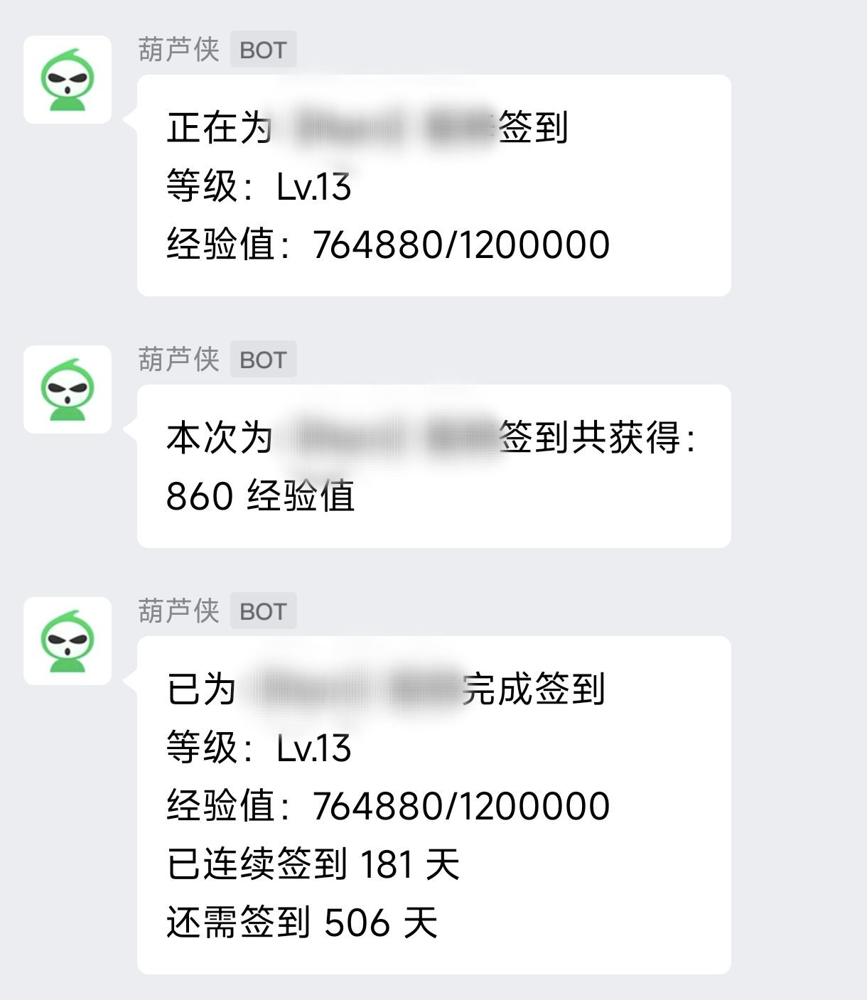
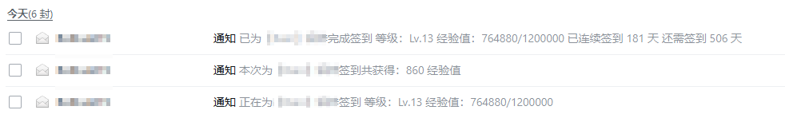

# 葫芦侠三楼每日自动签到 🚀

> **💯42个版块精准签到**
> 
> **🗂️多账号支持**
>
> 
> **🕗每日定时执行**
> 
> **❇️不影响葫芦侠使用**

###### **最后更新日期：2024年12月02日 22点39分**

### 配置步骤 🛠️

1. **Fork本项目**：
   - 点击右上角`Fork`按钮，将本项目Fork到你的仓库。

2. **设置Github Secrets**：
   - 进入你的仓库，点击`Settings`。
   - 选择`Secrets and variables` -> `Actions`。
   - 点击`New repository secret`，添加名为`NOTIFIER_TYPE`的Secret，值既为可选的推送方式：`wechat`(企业微信群机器人推送)、`email`(邮箱推送)和`none`(默认不推送签到消息）。详情请参考下方消息推送方式。
   - 点击`New repository secret`，添加名为`ACCOUNTS`的Secret，值为你的账号信息，格式如下：<br/>
   [手机号][英文逗号][密码]
     ```
     account1,password1
     account2,password2
     ```

3. **在Github Actions中创建```main.yml```**：
   - 进入你的仓库，点击`Actions`。
   - 点击`New workflow`，选择`Set up a workflow yourself`。
   - 将以下内容粘贴到 `main.yml` 文件中：
     ```yaml
     name: huluxia_signin
     on:
       schedule:    # 定时触发
         - cron: '0 16 * * *'  # 24点
       workflow_dispatch:  # 支持手动触发
     jobs:
       build:
         runs-on: ubuntu-latest
         steps:
           - name: Checkout
             uses: actions/checkout@v3
           - name: '初始化python环境'
             uses: actions/setup-python@v4
             with:
                python-version: 3.10.11
           - name: '安装依赖'
             run: |
               pip install --upgrade pip
               pip install -r ./requirements.txt
           - name: '开始运行'
             id: signin-outputs
             env:
               # 不需要的推送形式可以直接注释，反之你需要取消注释            
               NOTIFIER_TYPE: ${{ secrets.NOTIFIER_TYPE }} 
               # EMAIL_CONFIG: ${{ secrets.EMAIL_CONFIG }}
               # WECHAT_ROBOT_URL: ${{ secrets.WECHAT_ROBOT_URL }}
               ACCOUNTS: ${{ secrets.ACCOUNTS }}
             run: |
               python ./main.py
     ```

4. **运行Github Actions**：
   - 设置好的 schedule 将会每日自动执行签到任务。
   - 你也可以随时进入 `Actions` 页面，选择 `huluxia_signin` workflow，然后点击 `Run workflow` 手动触发签到任务。

### 消息推送方式 📢

目前支持**企业微信群机器人推送**、**邮箱推送**和**不推送**三种方式。
1. **企业微信群机器人推送**：

   - 配置`WECHAT_ROBOT_URL`环境变量，值为企业微信群机器人的Webhook地址，具体获取方法请参考[企业微信群机器人文档](https://open.work.weixin.qq.com/help2/pc/14931?person_id=1)。
   - 该推送方式需要在Github Secrets中设置`WECHAT_ROBOT_URL`变量。

2. **邮箱推送**：

   - 如果你希望通过邮箱进行推送，可以设置`EMAIL_CONFIG`环境变量，格式如下：
     ```json
     {
         "username": "your_email@qq.com",
         "auth_code_or_password": "your_email_auth_code",
         "sender_email": "your_email@qq.com",
         "recipient_email": "recipient_email@qq.com"
     }
     ```
     配置完`EMAIL_CONFIG`后，程序将自动通过SMTP发送推送通知
3. **不推送**：
   - 如果你不希望推送签到消息，可以设置`NOTIFIER_TYPE`环境变量为`none`。
   
如果你有其他推送需求或希望增加其他推送方式，欢迎提交PR或提出Issue。

### 企业微信群机器人推送效果图 📸



### 邮箱推送效果图 📸



### 使用声明 ⚠️

本项目仅供学习和交流使用，请勿用于任何商业用途。使用者需自行承担因使用本项目而产生的任何风险和责任。

[](https://star-history.com/#BoltLv4215/huluxia_thirdfloor_signin&Date)<br/>

**🚩By [BoltLv4215](https://github.com/BoltLv4215 "点个Star和Follow吧！")**<br/>

